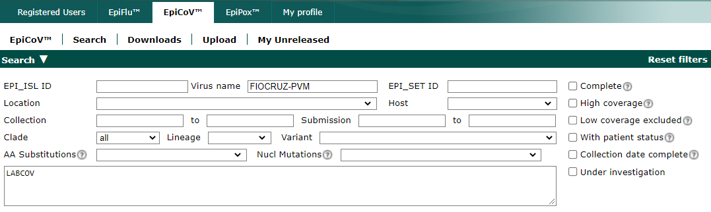

# Plataforma de Vigilância Molecular

## Análises do sequenciamento de genoma completo de SARS-CoV-2

- [Requisitos do sistema][https://github.com/khourious/labstuffs/blob/master/projects/pvm/pvm_sarscov2.md#requisitos-do-sistema]
- [Programas necessários][https://github.com/khourious/labstuffs/blob/master/projects/pvm/pvm_sarscov2.md#programas-necess%C3%A1rios]
- [Configuração do Linux para as análises de montagem dos genomas e construção dos relatórios][https://github.com/khourious/labstuffs/blob/master/projects/pvm/pvm_sarscov2.md#configura%C3%A7%C3%A3o-do-linux-para-as-an%C3%A1lises-de-montagem-dos-genomas-e-constru%C3%A7%C3%A3o-dos-relat%C3%B3rios]
- [Atualização das bases de dados utilizadas para os relatórios][https://github.com/khourious/labstuffs/blob/master/projects/pvm/pvm_sarscov2.md#atualiza%C3%A7%C3%A3o-das-bases-de-dados-utilizadas-para-os-relat%C3%B3rios]
- [Requisição da lista de amostras para extração e sequenciamento do SARS-CoV-2][https://github.com/khourious/labstuffs/blob/master/projects/pvm/pvm_sarscov2.md#atualiza%C3%A7%C3%A3o-das-bases-de-dados-utilizadas-para-os-relat%C3%B3rios]
- [Download dos dados da corrida de sequenciamento][https://github.com/khourious/labstuffs/blob/master/projects/pvm/pvm_sarscov2.md#download-dos-dados-da-corrida-de-sequenciamento]
- [Avaliação da qualidade da corrida de sequenciamento][https://github.com/khourious/labstuffs/blob/master/projects/pvm/pvm_sarscov2.md#avalia%C3%A7%C3%A3o-da-qualidade-da-corrida-de-sequenciamento]
- [Montagem do genomas de SARS-CoV2][https://github.com/khourious/labstuffs/blob/master/projects/pvm/pvm_sarscov2.md#montagem-do-genomas-de-sars-cov2]
- [Relatório REDCap][https://github.com/khourious/labstuffs/blob/master/projects/pvm/pvm_sarscov2.md#relat%C3%B3rio-redcap]
- [Submissão GISAID][https://github.com/khourious/labstuffs/blob/master/projects/pvm/pvm_sarscov2.md#submiss%C3%A3o-gisaid]
- [Envio do relatório REDCAP para REDCap FIOCRUZ][https://github.com/khourious/labstuffs/blob/master/projects/pvm/pvm_sarscov2.md#envio-do-relat%C3%B3rio-redcap-para-redcap-fiocruz]
- [Relatório CIEVS][https://github.com/khourious/labstuffs/blob/master/projects/pvm/pvm_sarscov2.md#relat%C3%B3rio-cievs]
  - [E-mail para o CIEVS][https://github.com/khourious/labstuffs/blob/master/projects/pvm/pvm_sarscov2.md#e-mail-para-o-cievs]
- [Relatório Rede Genômica Fiocruz][https://github.com/khourious/labstuffs/blob/master/projects/pvm/pvm_sarscov2.md#relat%C3%B3rio-rede-gen%C3%B4mica-fiocruz]
  - [E-mail para a Rede Genômica Fiocruz # HSR][https://github.com/khourious/labstuffs/blob/master/projects/pvm/pvm_sarscov2.md#e-mail-para-a-rede-gen%C3%B4mica-fiocruz--hsr]
  - [E-mail para a Rede Genômica Fiocruz # LABCOV][https://github.com/khourious/labstuffs/blob/master/projects/pvm/pvm_sarscov2.md#e-mail-para-a-rede-gen%C3%B4mica-fiocruz--labcov]
  - [E-mail para a Rede Genômica Fiocruz # LACEN-BA / PVM-IGM][https://github.com/khourious/labstuffs/blob/master/projects/pvm/pvm_sarscov2.md#e-mail-para-a-rede-gen%C3%B4mica-fiocruz--lacen-ba--pvm-igm]
- [Backup dos dados][https://github.com/khourious/labstuffs/blob/master/projects/pvm/pvm_sarscov2.md#backup-dos-dados]
- [Backup e envio dos dados para os colaboradores # LABCOV][https://github.com/khourious/labstuffs/blob/master/projects/pvm/pvm_sarscov2.md#backup-e-envio-dos-dados-para-os-colaboradores--labcov]

### Requisitos do sistema

|     |                                      |
| --- | ------------------------------------ |
| CPU | 8ª geração Intel Core i5 ou superior |
| RAM | 8 GB ou superior                     |
| SO  | Windows 10 (64-bit) ou superior      |
| WSL | versão 2                             |

### Programas necessários

- [Epi Info][https://www.cdc.gov/epiinfo/support/por/pt_downloads.html]
- [Illumina BaseSpace Sequence Hub CLI][https://developer.basespace.illumina.com/docs/content/documentation/cli/cli-overview]
- [Illumina Sequencing Analysis Viewer (SAV)][https://support.illumina.com/sequencing/sequencing_software/sequencing_analysis_viewer_sav/downloads.html]
- [Microsoft Office 365 Educação][https://www.microsoft.com/pt-br/education/products/office]
- [Microsoft OneDrive][https://www.microsoft.com/pt-br/microsoft-365/onedrive/download]
- [Microsoft Teams][https://www.microsoft.com/pt-br/microsoft-teams/download-app]
- [Notepadd++][https://notepad-plus-plus.org/downloads]
- [VIral GEnome ASsembly pipelines for WGS (vigeas)][https://github.com/khourious/vigeas]
- [Windows Subsystem for Linux 2 (WSL2)][https://learn.microsoft.com/pt-br/windows/wsl/install]

### Configuração do Linux para as análises de montagem dos genomas e construção dos relatórios

Logar no [MS Teams][https://github.com/khourious/labstuffs/blob/master/projects/pvm/pvm_sarscov2.md#programas-necess%C3%A1rios] e criar atalhos dentro do [OneDrive][https://github.com/khourious/labstuffs/blob/master/projects/pvm/pvm_sarscov2.md#programas-necess%C3%A1rios] para os seguintes diretórios:

- **Canal Diagnóstico**

```text
MS Teams -> PVM-IGM -> Diagnóstico -> Arquivos -> Sistemas -> Soroteca -> Adicionar atalho ao OneDrive
```

- **Canal Dados**

```text
MS Teams -> PVM-IGM -> Dados -> Arquivos -> Sistemas -> Soroteca -> Adicionar atalho ao OneDrive
```

- **Canal Sequenciamento**

```text
MS Teams -> PVM-IGM -> Sequenciamento -> Arquivos -> Adicionar atalho ao OneDrive
```

- **Canal Envios**

```text
MS Teams -> PVM-IGM -> Envios -> Arquivos -> Adicionar atalho ao OneDrive
```

Após criar atalhos no [OneDrive][https://github.com/khourious/labstuffs/blob/master/projects/pvm/pvm_sarscov2.md#programas-necess%C3%A1rios], checar se há a sincronização:

- No [WSL2][https://github.com/khourious/labstuffs/blob/master/projects/pvm/pvm_sarscov2.md#programas-necess%C3%A1rios]

```bash
# criar atalho para o diretório Dados presente no OneDrive
ln -s /mnt/c/OneDrive/OneDrive\ -\ FIOCRUZ/Dados/ PVM_DADOS

# criar atalho para o diretório Envios presente no OneDrive
ln -s /mnt/c/OneDrive/OneDrive\ -\ FIOCRUZ/Envios/ PVM_SEQ

# criar atalho para o diretório Sequenciamento presente no OneDrive
ln -s /mnt/c/OneDrive/OneDrive\ -\ FIOCRUZ/Sequenciamento/ PVM_SEQ

# criar diretório bin no $HOME do usuário do Linux
[ ! -d $HOME/bin ] && mkdir $HOME/bin

# criar atalho para os scripts dos relatórios dento do $HOME/bin
ln -s $HOME/PVM_DADOS/Scripts/* $HOME/bin/

# recarregar o perfil de configuração do shell
source $HOME/.$(ps -p $$ -ocomm=)rc

# criar diretório para armazenar os dados baixados do BaseSpace
[ ! -d /mnt/c/BaseSpace/ ] && mkdir /mnt/c/BaseSpace/

# criar atalho de acesso do diretório BaseSpace no $HOME do usuário do Linux
ln -s /mnt/c/BaseSpace/ BaseSpace

# clonar o repositório do pipeline de montagem dos genomas
git clone --recursive https://github.com/khourious/vigeas.git

# entrar no diretório vigeas
cd vigeas

# dar permissões de leitura e gravação ao arquivo de instalação das dependências do vigeas
chmod u+x INSTALL

# rodar a instalação do vigeas
bash INSTALL

# baixar o arquivo de instalação do BaseSpace CLI
wget "https://launch.basespace.illumina.com/CLI/latest/amd64-linux/bs" -O $HOME/bin/bs

# dar permissões de leitura e gravação ao BaseSpace
chmod u+x $HOME/bin/bs

# recarregar o perfil de configuração do shell
source $HOME/.$(ps -p $$ -ocomm=)rc

# gerar autorização de login do BaseSpace
bs auth
```

### Atualização das bases de dados utilizadas para os relatórios

É necessario copiar o arquivo `ControledeAmostras_FioCruz_be.mdb` localizado na intranet da FIOCRUZ `\IGM-FS\Arquivos\Grupos\DiagCOVID19\Sistemas\Soroteca` para o diretório `\OneDrive\OneDrive - FIOCRUZ\Dados\Bancos_PVM\Soroteca`.

Após copiar o `ControledeAmostras_FioCruz_be.mdb`, abrir o `Executar do Windows` utiizando o atalho `Windows+R` e rodar o `Prompt de Comando do Windows`:

```text
cmd
```

- No `cmd`

```bash
# rodar script do Epi Info para exportar os dados do da soroteca da PVM
"C:\OneDrive\OneDrive - FIOCRUZ\Dados\scripts\PVM_SOROTECA.pgm7"
```

- No [WSL2][https://github.com/khourious/labstuffs/blob/master/projects/pvm/pvm_sarscov2.md#programas-necess%C3%A1rios]

```bash
# rodar script para exportar e organizar todas as bases de dados utilizadas para os relatórios
PVM_DATABASES.sh
```

### Requisição da lista de amostras para extração e sequenciamento do SARS-CoV-2

Abrir o script de listagem das amostras para extração e sequenciamento do SARS-CoV-2 e editar o campo de data em `$75>="yyyy-mm-dd"`, o qual `yyyy-mm-dd` representa a data mínima da busca das amostras:

- No [WSL2][https://github.com/khourious/labstuffs/blob/master/projects/pvm/pvm_sarscov2.md#programas-necess%C3%A1rios]

```bash
nano $HOME/bin/PVMSEQ-EXTRACTION_DATE # abrir script com editor de texto nano
```

Salvar arquivo após edição:

```text
Ctrl+X -> Y -> Enter
```

Rodar o script:

- No [WSL2][https://github.com/khourious/labstuffs/blob/master/projects/pvm/pvm_sarscov2.md#programas-necess%C3%A1rios]

```bash
PVMSEQ-EXTRACTION_DATE # rodar script para gerar a planilha de requisição de extração de amostras
```

O arquivo será salvo em `\OneDrive\OneDrive - FIOCRUZ\Sequenciamento\REQUISICOES_SEQ`.

### Informar para o prompt de comando o nome da corrida de sequenciamento 

No [WSL2][https://github.com/khourious/labstuffs/blob/master/projects/pvm/pvm_sarscov2.md#programas-necess%C3%A1rios]

```bash
# criar array com o nome da biblioteca de sequenciamento
LIBRARY=IGM_PVM_MISEQ_DNAP_LIBRARYyyyymmdd
```

### Download dos dados da corrida de sequenciamento

No [WSL2][https://github.com/khourious/labstuffs/blob/master/projects/pvm/pvm_sarscov2.md#programas-necess%C3%A1rios]

```bash
# baixar os arquivos de qualidade da corrida
bs download run --no-metadata --summary -o $HOME/BaseSpace/"$LIBRARY"_SAV -n "$LIBRARY"

# baixar os arquivos fastQ
bs download project --no-metadata --summary --extension=fastq.gz -o $HOME/BaseSpace/"$LIBRARY" -n "$LIBRARY"
```

### Avaliação da qualidade da corrida de sequenciamento

Abrir o [Illumina Sequencing Analysis Viewer (SAV)][https://github.com/khourious/labstuffs/blob/master/projects/pvm/pvm_sarscov2.md#programas-necess%C3%A1rios] e carregar o diretório da corrida para análise da qualidade:

```bash
Browse -> This PC -> WINDOWS (C:) -> BaseSpace -> IGM_PVM_MISEQ_DNAP_LIBRARYyyyymmdd_SAV -> OK
```

Avaliar os seguintes critérios:

- Aba **Analysis**
  - `Data By Cycle -> Intensity`: o plot apresenta a intensidade de sinal de cada nucleotídeo em relação aos ciclos. O esperado é o aumento gradual da intensidade no R1 e R4.
  - `Data By Cycle -> FWHM`: full width half max -- o plot apresenta a massa e tamanho das leituras para cada nucleotídeo em relação aos ciclos. O esperado são valores entre 2.0 - 3.5.
  - `Data By Cycle -> %>=Q30`: o plot apresenta a porcentagem de leituras com índice de qualidade PHRED maior ou igual a 30 em relação aos ciclos. A escala PHRED estima a probabilidade de erro na identificação das bases. PHRED 30 quer dizer 1 erro a cada 1000 bases, ou seja, acurácia de 99.90%. O esperado é uma perda de no máximo 10% no R1 e R4.
  - `Qscore Distribution -> Lane:All`: o plot apresenta a quantidade de leituras em milhões em relação ao índice de qualidade PHRED. O esperado são valores acima de 80% para cartuchos 300-V2, acima de 85% para 150-V3 e acima de 70% para 600-V3.
  - `Data By Lane -> Density`: o plot apresenta a densidade total dos clusters detectados (azul) e dos clusters que passaram no filtro de qualidade de intensidade (verde) em relação à lane. O esperado é uma sobreposição dos boxplots, além de valores de densidade total dos clusters entre 600-1200 para cartuchos V2 e 1200-1400 para cartuchos V3.
  - `QScore Heatmap -> Lane:All`: o plot apresenta a avaliação do índice de qualidade PHRED em valor (eixo Y1), porcentagem das leituras (eixo Y2) em relação relação aos ciclos. O esperado é um heatmap com densidade mais próxima da cor vermelha por toda a construção das leituras no R1 e R4.

- Aba **Analysis**
  - As imagens podem ser utilizadas no caso de alterações nos parâmetros de qualidade para auxiliar no entendimento do problema.

- Aba **Summary**
  - `Run Summary -> Aligned (%)`: taxa de leituras alinhadas ao genoma PhiX. O esperado são valores próximos de 1%.
  - `Run Summary -> Error Rate (%)`: taxa de erro da corrida de sequenciamento calculada com base nas leituras alinhadas ao PhiX. O esperado são valores próximos de 0.10.
  - `Read 1 / Read 4 -> Density (K/mm2)`: taxa de densidade dos clusters detectados pela análise das imagens. O esperado são valores de densidade total dos clusters entre 600-1200 para cartuchos V2 e 1200-1400 para cartuchos V3.
  - `Read 1 / Read 4 -> Cluster PF (%)`: taxa dos clusters que passam no critério de qualidade de brilho obtido dos clusters na formação das imagens. O esperado são valores próximos de 100%, com desvio-padrão próximo de 0.10.
  - `Read 1 / Read 4 -> Legacy Phasing/Prephasing Rate`: taxa das moléculas em um cluster com perda de sincronismo no momento da detecção de fluorescência. *Phasing* é quando o sequenciamento *fica para trás* e *Prephasing*, quando *avança demais*. O esperado são valores iguais ou abaixo de 0.25 para R1 e R4.
  - `Read 1 / Read 4 -> %>=Q30`: taxa de bases geradas com um índice de qualidade PHRED igual ou maior que 30. A escala PHRED estima a probabilidade de erro na identificação das bases. PHRED 30 quer dizer 1 erro a cada 1000 bases, ou seja, acurácia de 99.90%. O esperado são valores acima de 80% para cartuchos 300-V2, acima de 85% para 150-V3 e acima de 70% para 600-V3.
  - `Read 1 / Read 4 -> Intensity Cycle 1`: média da intensidade da corrida mensurada após o ciclo 1. O esperado são valores acima de 90.

### Montagem do genomas de SARS-CoV2

Identificar o nome da biblioteca de sequenciamento para utilizar no Linux, editando o array `LIBRARY`:

- No [WSL2][https://github.com/khourious/labstuffs/blob/master/projects/pvm/pvm_sarscov2.md#programas-necess%C3%A1rios]

```bash
# converter quebras de linha do formato DOS para UNIX
dos2unix $HOME/PVM_SEQ/SAMPLE_SHEETS/"$LIBRARY".csv

# editar samplesheet da biblioteca de sequenciamento
nano $HOME/PVM_SEQ/SAMPLE_SHEETS/"$LIBRARY".csv
```

Avaliar a samplesheet do sequenciamento de acordo com os seguintes critérios:

- As amostras e controles não podem conter `-` ou `_` uma vez que estes caracteres são utilizados pelo script de montagem como delimitadores de arquivos.
- As amostras devem ser identificadas pelo tracking ID biobanco
- Identificador dos contoles devem sempre conter caractere numérico (*i.e.* MOCK01, CNCDNA01, CNPCR01, CP01).
- A coluna descrição deve conter a informação do esquema de primer utilizado (*i.e.* ARTIC_V4_1).

No [WSL2][https://github.com/khourious/labstuffs/blob/master/projects/pvm/pvm_sarscov2.md#programas-necess%C3%A1rios]

```bash
# atualizar lista de pacotes do linux
sudo apt-get -y update

# atualizar o linux e dependências instaladas
sudo apt-get -y full-upgrade

# remover dependências que não são mais necessárias
sudo apt-get autoremove

# remover arquivos de instalações de dependências
sudo apt-get auto-clean

# remover arquivos de instalações de dependências que o auto-clean não consegue resolver
sudo apt-get -y purge $(dpkg -l | awk '/^rc/ {print $2}')

# checar se há dependências quebradas
sudo apt-get check

# limpar o cachê do conda
conda clean -ay

# atualizar as dependências utililizadas pelos ambientes do vigeas-illumina
vigeas-illumina -u
```

No [WSL2][https://github.com/khourious/labstuffs/blob/master/projects/pvm/pvm_sarscov2.md#programas-necess%C3%A1rios]

```bash
# rodar o vigeas para realizar a montagem dos genomas de SARS-CoV-2
vigeas-illumina -w 1 -s $HOME/PVM_SEQ/SAMPLE_SHEETS/"$LIBRARY".csv -i $HOME/BaseSpace/"$LIBRARY" -d 10
```

A montagem dos genoma demora cerca de 2 minutos por genoma em um computador com *hardware* de 9ª geração Intel Core i7 com 16 GB de memória RAM.

Ao final da montagem dos genomas, avaliar as seguintes situações:

- `IGM_PVM_MISEQ_DNAP_LIBRARYyyyymmdd.log.*. yyyy-mm-dd.txt`: se há erros na análise.
- `IGM_PVM_MISEQ_DNAP_LIBRARYyyyymmdd.consensus.*.yyyy-mm-dd.fasta`: se quantidade de genomas está em conformidade com a samplesheet.
- `IGM_PVM_MISEQ_DNAP_LIBRARYyyyymmdd.coverage.*.yyyy-mm-dd.pdf`: se quantidade de plots de cobertura e profundidade está em conformidade com a samplesheet e se houve eventuais problemas de montagem.
- `IGM_PVM_MISEQ_DNAP_LIBRARYyyyymmdd.summary.SARS-CoV-2.*.yyyy-mm-dd.txt`: se quantidade de genomas está em conformidade com a samplesheet e se as métricas de montagem estão completas.

### Relatório REDCap

No [WSL2][https://github.com/khourious/labstuffs/blob/master/projects/pvm/pvm_sarscov2.md#programas-necess%C3%A1rios]

```bash
# entrar no diretório dos documentos da biblioteca de sequenciamento
cd $HOME/PVM_SEQ/DOCUMENTOS/"$LIBRARY"

# renomear os arquivos para não apresentarem espaços
for f in *\ *; do rename=$(echo "$f" | sed 's/ /_/g; s/[^A-Za-z0-9_.]/_/g');  mv "$f" "$rename"; done

# rodar script para gerar os documentos que serão utilizados na montagem dos relatórios
PVM_DATA.sh $HOME/PVM_SEQ/SAMPLE_SHEETS/"$LIBRARY".csv
```

Os arquivos gerados pelo script são:

- `IGM_PVM_MISEQ_DNAP_LIBRARYyyyymmdd_ASSEMBLY.txt`: contém esquema de sequenciamento e versão dos programas utilizados para montagem dos genomas.
- `IGM_PVM_MISEQ_DNAP_LIBRARYyyyymmdd_BIOBANCO.txt`: contém o tracking ID biobanco das amostras.
- `IGM_PVM_MISEQ_DNAP_LIBRARYyyyymmdd_PRIMERS.txt`: contém o tracking ID biobanco e esquema de primers.
- `IGM_PVM_MISEQ_DNAP_LIBRARYyyyymmdd_REC.txt`: contém o número REC equivalente para cada tracking ID biobanco.
- `PVM-SEQ_REDCap_IGM_PVM_MISEQ_DNAP_LIBRARYyyyymmdd.tsv`: relatório REDCap.
- `SolicitacaoMDB_ViaBiobanco_yyyy-mm-dd.tsv`: arquivo auxiliar para montagem do relatório REDCap.
- `SolicitacaoGal29_ViaGal_yyyy-mm-dd.tsv`: arquivo auxiliar para montagem do relatório REDCap.

Abrir a planilha `PVM-SEQ_REDCap_IGM_PVM_MISEQ_DNAP_LIBRARYyyyymmdd.tsv` utilizando o [MS Excel][https://github.com/khourious/labstuffs/blob/master/projects/pvm/pvm_sarscov2.md#programas-necess%C3%A1rios] e manipular o arquivo de acordo com os seguintes critérios:

- Transformar a disposição dos dados das colunas `gal_id` e `cns` em número e retirar os números decimais adicionados.
- Copiar os dados para [notepadd++][https://github.com/khourious/labstuffs/blob/master/projects/pvm/pvm_sarscov2.md#programas-necess%C3%A1rios].
- Transformar a disposição dos dados da planilha em `texto`.
- Colar os dados do [notepadd++][https://github.com/khourious/labstuffs/blob/master/projects/pvm/pvm_sarscov2.md#programas-necess%C3%A1rios] de volta para a planilha.
- Salvar a planilha `PVM-SEQ_REDCap_IGM_PVM_MISEQ_DNAP_LIBRARYyyyymmdd.tsv` em formato "Excel 97-2003 Workbook (*.xls)" com nome `PVM-SEQ_REDCap_IGM_PVM_MISEQ_DNAP_LIBRARYyyyymmdd.xls`.

- Completar os dados faltantes:
  - **seq_id**: confirmar ID no REDCap utilizando o arquivo `REDCap_SequenciamentoDeSARS_DATA_yyyy-mm-dd` disponível no diretório `\OneDrive\OneDrive - FIOCRUZ\Sequenciamento\BANCO_DE_DADOS` e seguir a númeração para as novas entradas.
  - **gal_id**: utilizar as planilhas `SolicitacaoGal29_ViaGal_yyyy-mm-dd.csv` e `SolicitacaoMDB_ViaBiobanco_yyyy-mm-dd` para completar os dados faltantes.
  - **req_sequenc**: adicionar a sigla do requisitante do sequenciamento:
    - `HSR`: Hospital São Rafael
    - `LABCOV`: Laboratório de Diagnóstico Molecular da COVID-19 do CCS/UFRB
    - `LACEN-BA`: Laboratório Central da Bahia
    - `LAPEM`: Laboratório de Patologia Estrutural e Molecular do IGM/FIOCRUZ
    - `LJC`: Laboratório Jaime Cerqueira
    - `PVM`: Plataforma de Vigilância Molecular do IGM/FIOCRUZ
  - **dt_coleta**: dispor a data de coleta no formato yyyy-mm-dd.
  - **biobanco_seq / primer_schem**: utilizar o arquivo `IGM_PVM_MISEQ_DNAP_LIBRARYyyyymmdd_PRIMERS` para obter as informações de biobanco e esquema de primers.
  - **pipe_assembly / depth_assembly**: utilizar o arquivo `IGM_PVM_MISEQ_DNAP_LIBRARYyyyymmdd_ASSEMBLY` para obter as informações de sequenciamento, montagem e profundidade utilizada para geração do genoma consenso.
  - **num_total_reads / num_mapp_reads / avg_depth / depth_10x / depth_100x / depth_1000x / ref_cov / ncount / ncount_perc / pango_ver / pango_database_ver / pango_lin / nextclade_ver / clade / nucl_substitutions / nucl_deletions / nucl_inserc / nucl_missing / aa_substitutions / aa_deletions**: utilizar o arquivo `IGM_PVM_MISEQ_DNAP_LIBRARYyyyymmdd.summary.SARS-CoV-2.*.yyyy-mm-dd.txt` gerado na montagem dos genomas para obter as informações das métricas de montagem e definição de linhagem e características do vírus.
  - **gal_complete**: adicionar o valor 2 para todas as entradas.
  - Abrir a planilha `IGM_PVM_MISEQ_DNAP_LIBRARYyyyymmdd.summary.SARS-CoV-2.*.yyyy-mm-dd` utilizando o [MS Excel][https://github.com/khourious/labstuffs/blob/master/projects/pvm/pvm_sarscov2.md#programas-necess%C3%A1rios] e copiar as métricas de sequenciamento.
  - Salvar as modificações e depois exportar a planilha em formato "Text (Tab delimited) (*.txt)" com nome `PVM-SEQ_REDCap_IGM_PVM_MISEQ_DNAP_LIBRARYyyyymmdd.txt`.

No [WSL2][https://github.com/khourious/labstuffs/blob/master/projects/pvm/pvm_sarscov2.md#programas-necess%C3%A1rios]

```bash
# entrar no diretório dos documentos da biblioteca de sequenciamento
cd $HOME/PVM_SEQ/DOCUMENTOS/"$LIBRARY"

# utilizar o relatório RECap e os arquivos fasta dos genomas para poder gerar os demais relatórios
PVM_REPORT.sh PVM-SEQ_REDCap_"$LIBRARY".txt $HOME/vigeas/"$LIBRARY"_ANALYSIS/"$LIBRARY".consensus.*.fasta
```

Serão gerados os seguintes arquivos:

- `RelatorioCIEVS_yyyy-mm-dd.csv`: arquivo que será encaminhada como relatório para o ***Centro de Informações Estratégicas em Vigilância em Saúde (CIEVS)*** da Secretaria de Estado de Saúde da Bahia (SESAB). O arquivo está salvo no diretório `\OneDrive\OneDrive - FIOCRUZ\Sequenciamento\RELATORIOS\CIEVS`.
- `hCoV-19_FIOCRUZ_BA_PVM_yyyymmdd.tsv` / `hCoV-19_FIOCRUZ_BA_PVM_yyyymmdd.fasta`: arquivos que serão utilizados para organizar a submissão dos genomas para o ***GISAID***. Os arquivos estão salvos no diretório `\OneDrive\OneDrive - FIOCRUZ\Sequenciamento\RELATORIOS\GISAID`.
- `RelatorioRedeGenomica_FIOCRUZBahia_yyyy-mm-dd.csv`: arquivo que será utilizado para organizar o relatório relatório da ***Rede Genômica Fiocruz*** da Fundação Oswaldo Cruz (FIOCRUZ). O arquivo está salvo no diretório `\OneDrive\OneDrive - FIOCRUZ\Sequenciamento\RELATORIOS\REDE_GENOMICA`.

### Submissão GISAID

Para a submissão são necessários um arquivo multifasta com os genomas e uma planilha com os metadados requeridos pelo GISAID. O modelo da planilha está disponível no diretório `\OneDrive\OneDrive - FIOCRUZ\Sequenciamento\RELATORIOS`.

- Abrir o arquivo `hCoV-19_FIOCRUZ_BA_PVM_yyyymmdd.xlt`  utilizando o [MS Excel][https://github.com/khourious/labstuffs/blob/master/projects/pvm/pvm_sarscov2.md#programas-necess%C3%A1rios] e prencher com os dados presentes no arquivo `hCoV-19_FIOCRUZ_BA_PVM_yyyymmdd.tsv`.
- Salvar a planilha `hCoV-19_FIOCRUZ_BA_PVM_yyyymmdd.xlt` em formato "Excel 97-2003 Workbook (*.xls)" com nome `hCoV-19_FIOCRUZ_BA_PVM_yyyymmdd.xls`.
- Deletar `hCoV-19_FIOCRUZ_BA_PVM_yyyymmdd.tsv`.

#### Submissão via web

- Entrar no endereço [https://www.epicov.org/epi3/frontend][https://www.epicov.org/epi3/frontend].
- Utilizar username RKhour0.
- Acessar o ambiente de submissão dos arquivos:

```text
EpiCov -> Upload -> Batch Upload
```

- Adicionar em **Metadata as Excel or CSV** o arquivo `hCoV-19_FIOCRUZ_BA_PVM_yyyymmdd.xls`.
- Adicionar em **Sequences as FASTA** o arquivo `hCoV-19_FIOCRUZ_BA_PVM_yyyymmdd.fasta`.
- Modificar os arquivos em caso de alguma sequencia já ter sido adicionada previamente no GISAID e enviar novamente.

#### Submissão via GISAID CLI

- Checar a validade do login via GISAID CLI:
  - No [WSL2][https://github.com/khourious/labstuffs/blob/master/projects/pvm/pvm_sarscov2.md#programas-necess%C3%A1rios]

```bash
# abrir arquivo token de login e checar a data de expiração
cat $HOME/PVM_DADOS/Relatorios/GISAID/gisaid.authtoken | awk -F", " '{print $NF}'
```

- Em caso de expiração de login, realizar a autenticação utilizando username RKhour0 e client-ID cid-b3382c70dcc41:
  - No [WLS2][https://github.com/khourious/labstuffs/blob/master/projects/pvm/pvm_sarscov2.md#programas-necess%C3%A1rios]

```bash
# autenticar o GISAID CLI
cli3 authenticate
```

- Converter o arquivo `hCoV-19_FIOCRUZ_BA_PVM_yyyymmdd.xls` para o formato *.csv:
  - No [WLS2][https://github.com/khourious/labstuffs/blob/master/projects/pvm/pvm_sarscov2.md#programas-necess%C3%A1rios]

```bash
# entrar no diretório dos relatórios do GISAID
cd $HOME/PVM_DADOS/Relatorios/GISAID/

# converter arquivo *.xls para *.csv
ssconvert hCoV-19_FIOCRUZ_BA_PVM_$(date +'%Y%m%d').xls hCoV-19_FIOCRUZ_BA_PVM_$(date +'%Y%m%d').csv
```

- Enviar os dados de submissão:
  - No [WLS2][https://github.com/khourious/labstuffs/blob/master/projects/pvm/pvm_sarscov2.md#programas-necess%C3%A1rios]

```bash
# enviar sequências fasta do SARS-CoV-2 e metadados para o GISAID, e no final, gerar um log com as informações dos IDs GISAID das amostras
cli3 upload --database EpiCoV --metadata $HOME/PVM_DADOS/Relatorios/GISAID/hCoV-19_FIOCRUZ_BA_PVM_$(date +'%Y%m%d').csv --fasta $HOME/PVM_DADOS/Relatorios/GISAID/hCoV-19_FIOCRUZ_BA_PVM_$(date +'%Y%m%d').fasta --log $HOME/PVM_DADOS/Relatorios/GISAID/hCoV-19_FIOCRUZ_BA_PVM_$(date +'%Y%m%d').log
```

### Envio do relatório REDCAP para REDCap FIOCRUZ

Após submissão dos genomas no GISAID, utilizar o log gerado do  envio para criar uma lista com informações para completar o relatório REDCap com as variáveis :`seq_virus_name`, `gisaid_login` e `gisaid_login`.

- No [WLS2][https://github.com/khourious/labstuffs/blob/master/projects/pvm/pvm_sarscov2.md#programas-necess%C3%A1rios]

```bash
# gerar lista com seq_virus_name, gisaid_login e gisaid_id
cat $HOME/PVM_DADOS/Relatorios/GISAID/hCoV-19_FIOCRUZ_BA_PVM_$(date +'%Y%m%d').log | grep "epi_isl_id" | sed 's/{"code": "epi_isl_id", "msg": "//g' | sed 's/"}//g' | awk -F";" '{print $1"\t"$1"\t"$2}' | awk -F"\t" '{$1=substr($1,30); print $1"\t"$2"\tRKhour0\t"$3} ' | awk -F"\t" '{$1 = substr($1,0,length($1)-5)}1' OFS="\t" > $HOME/PVM_SEQ/DOCUMENTOS/"$LIBRARY"/GISAID_IDS_"$LIBRARY".txt
```

Abrir a planilha do relatório REDCAp `PVM-SEQ_REDCap_IGM_PVM_MISEQ_DNAP_LIBRARYyyyymmdd.xls` utilizando o [MS Excel][https://github.com/khourious/labstuffs/blob/master/projects/pvm/pvm_sarscov2.md#programas-necess%C3%A1rios] e manipular o arquivo de acordo com os seguintes critérios:

- Completar os dados faltantes:
  - **seq_virus_name** / **gisaid_login** / **gisaid_id**: utilizar o arquivo `GISAID_IDS_IGM_PVM_MISEQ_DNAP_LIBRARYyyyymmdd.txt` salvo na etapa anterior no diretório `\OneDrive\OneDrive - FIOCRUZ\Sequenciamento\CORRIDAS\DOCUMENTOS\IGM_PVM_MISEQ_DNAP_LIBRARYyyyymmdd` para completar os dados faltantes.

  - Salvar as modificações da planilha, mantendo formato: "Excel 97-2003 Workbook (*.xls)".

  - Converter a planilha do relatório REDCap para o formato *.csv:
    - No [WLS2][https://github.com/khourious/labstuffs/blob/master/projects/pvm/pvm_sarscov2.md#programas-necess%C3%A1rios]

```bash
# converter arquivo *.xls para *.csv
ssconvert $HOME/PVM_SEQ/DOCUMENTOS/"$LIBRARY"/PVM-SEQ_REDCap_"$LIBRARY".xls $HOME/PVM_SEQ/DOCUMENTOS/"$LIBRARY"/PVM-SEQ_REDCap_"$LIBRARY".csv
```

- Entrar no endereço [https://bdp.bahia.fiocruz.br][https://bdp.bahia.fiocruz.br], logar, ir para o Projeto `Sequenciamento de SARS-CoV-2` e acessar o ambiente importação de dados:

```text
My Projects -> SARS-CoV-2 -> Sequenciamento de SARS-CoV-2 -> Applications -> Data Import Tool
```

- Em `Upload your CSV file`, clicar em `Choose File`, selecionar o relatório REDCAP em formato *.csv (`PVM-SEQ_REDCap_IGM_PVM_MISEQ_DNAP_LIBRARYyyyymmdd.csv`), clicar em `Open` e por fim, em `Upload File`.

- Após enviar o arquivo confirmar se os dados carregados estão dispostos corretamente e clicar em `Import Data` para finalizar o processo.

- Prosseguir para as demais etapas de relatórios (CIEVS e Rede Genômica Fiocruz), backup e envio dos dados para os colaboradores.

- Obter o banco de dados do REDCAp FIOCRUZ de Sequenciamento de SARS-CoV-2 atualizado:
  - No [WLS2][https://github.com/khourious/labstuffs/blob/master/projects/pvm/pvm_sarscov2.md#programas-necess%C3%A1rios]

```bash
REDCap-SARSSeq # obter a base de dados do REDCap FIOCRUZ de Sequenciamento de SARS-CoV-2
```


### Relatório CIEVS

Abrir o arquivo `RelatorioCIEVS_yyyy-mm-dd.csv` utilizando o [MS Excel][https://github.com/khourious/labstuffs/blob/master/projects/pvm/pvm_sarscov2.md#programas-necess%C3%A1rios] e avaliar de acordo com os seguintes critérios:

- Checar se a coluna `NUMERO DE REQUISICAO` está devidamente preenchida.
- Checar se a coluna `VOC` contém a informação escrita da VOC em questão.

#### E-mail para o CIEVS

Enviar e-mail para o CIEVS com o arquivo `RelatorioCIEVS_yyyy-mm-dd.csv` em anexo, com as seguintes informações:

- **Destinatários**

```text
cievs.notifica@saude.ba.gov.br; pvm@fiocruz.br; ricardo_khouri@hotmail.com
```

- **Assunto**

```text
Relatório CIEVS de linhagens de SARS-CoV-2 no estado da Bahia
```

- **Corpo do e-mail**

```text
Prezados,

Segue anexo o relatório com a linhagem dos genomas de SARS-CoV-2 recuperado de amostras no estado da Bahia. Estamos a disposição para maiores esclarecimentos. Muito obrigado pela colaboração na rede de vigilância genômica no país.
```

### Relatório Rede Genômica Fiocruz

Para a submissão são necessários um arquivo `*.pdf` do relatório e uma planilha `*.csv` com os dados que compõem o relatório. O modelo do relatório está disponível no diretório `\OneDrive\OneDrive - FIOCRUZ\Sequenciamento\RELATORIOS`.

- Abrir o arquivo modelo do relatório utilizando o [MS PowerPoint][https://github.com/khourious/labstuffs/blob/master/projects/pvm/pvm_sarscov2.md#programas-necess%C3%A1rios]. Utilizar os arquivos de acordo com o requisitante do sequenciamento:
  - **HSR**: `RelatorioRedeGenomica_FIOCRUZBahia_HSR.potx`
  - **LABCOV**: `RelatorioRedeGenomica_FIOCRUZBahia_LABCOV.potx`
  - **LACEN-BA** / **PVM**: `RelatorioRedeGenomica_FIOCRUZBahia_GAL.potx`
  - **LAPEM**: `RelatorioRedeGenomica_FIOCRUZBahia_LAPEM.potx`
  - **LJC**: `RelatorioRedeGenomica_FIOCRUZBahia_LJC.potx`
  - **PVM**: `RelatorioRedeGenomica_FIOCRUZBahia_GAL.potx`

- Adicionar as seguintes informações adicionais:
  - A data do dia da confecção do relatório é informada como `Versão`.
  - Especificar o laboratório de origem no caso do `LACEN-BA` ou `PVM-IGM`
  - Substituir `XX` pela quantidade de genomas incluídos no relatório em questão.
  - Substituir a versao do pangolin e da base de dados pela utilizada na montagem (*i.e.* Pangolin v.4.0.6 / PUSHER-v1.9).
  - Abrir o arquivo `RelatorioRedeGenomica_FIOCRUZBahia_yyyy-mm-dd.csv` e configurar os dados em: ***Arial, fonte tamanho 10, centralizado***.
  - Prencher as tabelas com os dados configurados da planilha `RelatorioRedeGenomica_FIOCRUZBahia_yyyy-mm-dd.csv`.
  - Salvar o arquivo em formato `PowerPoint Presentation (*.pptx)` com nome `RelatorioRedeGenomica_FIOCRUZBahia_yyyy-mm-dd.pptx`.
  - Exportar o arquivo em formato `PDF (*.pdf)` com nome `RelatorioRedeGenomica_FIOCRUZBahia_yyyy-mm-dd.pdf`.
  - Na planilha `Produção RGF enviados para o ministério - fechamento toda a quinta-feira`, na aba `IGM`, adicionar a quantidade de genomas submetidos no **GISAID** e nos relatórios da Rede Genômica Fiocruz. A planilha está disponível no [Google Sheets](https://docs.google.com/spreadsheets/d/1UXb4GcDQ7iKnM92Z20iJaxWWgyw536H0By7RdrsqkRc/edit?pli=1#gid=0)

#### E-mail para a Rede Genômica Fiocruz # HSR

Enviar e-mail para os integrantes da Rede Genômica Fiocruz com os arquivos `RelatorioRedeGenomica_FIOCRUZBahia_yyyy-mm-dd_HSR.csv` e `RelatorioRedeGenomica_FIOCRUZBahia_yyyy-mm-dd_HSR.pdf` em anexo, com as seguintes informações:

- **Destinatários**

```text
arnaldo.medeiros@saude.gov.br; brunosolanosouza@gmail.com; camila.bacia@hsr.com.br; camila.indiani@fiocruz.br; carolina.nonaka@hsr.com.br; cievs.notifica@saude.ba.gov.br; elisa.cavalcante@ioc.fiocruz.br; fcm@ioc.fiocruz.br; greice.madeleine@saude.gov.br; gripe@saude.gov.br; lacen.clavep@saude.ba.gov.br; marilda.goncalves@fiocruz.br; miriam.livorati@saude.gov.br; mmsiq@ioc.fiocruz.br; notificasalvador@gmail.com; paola@ioc.fiocruz.br; pvm@fiocruz.br; ricardo.riccio@fiocruz.br; ricardo_khouri@hotmail.com; thiago.guedes@saude.gov.br; tiago.graf@fiocruz.br; vitor.martins@ioc.fiocruz.br; walquiria.almeida@saude.gov.br
```

- **Assunto**

```text
Relatório Rede Genômica de linhagens de SARS-CoV-2 no estado da Bahia
```

- **Corpo do e-mail**

```text
Prezados,

Segue anexo o relatório com a linhagem dos genomas de SARS-CoV-2 recuperados de amostras Hospital São Rafael. Para maiores esclarecimentos sobre as amostras, por favor, contactar Dra Camila Bacia (camila.bacia@hsr.com.br), infectologista do Hospital São Rafael. Muito obrigado pela colaboração na rede de vigilância genômica no país.
```

#### E-mail para a Rede Genômica Fiocruz # LABCOV

Enviar e-mail para os integrantes da Rede Genômica Fiocruz com os arquivos `RelatorioRedeGenomica_FIOCRUZBahia_yyyy-mm-dd_LABCOV.csv` e `RelatorioRedeGenomica_FIOCRUZBahia_yyyy-mm-dd_LABCOV.pdf` em anexo, com as seguintes informações:

- **Destinatários**

```text
hermespedreira@ufrb.edu.br; pvm@fiocruz.br; ricardo_khouri@hotmail.com
```

- **Assunto**

```text
Relatório Rede Genômica de linhagens de SARS-CoV-2 no estado da Bahia
```

- **Corpo do e-mail**

```text
Prezados,

Segue anexo o relatório com a linhagem dos genomas de SARS-CoV-2 recuperado de amostras no estado da Bahia. Estamos a disposição para maiores esclarecimentos. Muito obrigado pela colaboração na rede de vigilância genômica no país.
```

#### E-mail para a Rede Genômica Fiocruz # LACEN-BA / PVM-IGM

Enviar e-mail para os integrantes da Rede Genômica Fiocruz com os arquivos `RelatorioRedeGenomica_FIOCRUZBahia_yyyy-mm-dd.csv` e `RelatorioRedeGenomica_FIOCRUZBahia_yyyy-mm-dd.pdf` em anexo, com as seguintes informações:

- **Destinatários**

```text
arnaldo.medeiros@saude.gov.br; camila.indiani@fiocruz.br; cievs.notifica@saude.ba.gov.br; elisa.cavalcante@ioc.fiocruz.br; fcm@ioc.fiocruz.br; greice.madeleine@saude.gov.br; gripe@saude.gov.br; lacen.clavep@saude.ba.gov.br; marilda.goncalves@fiocruz.br; miriam.livorati@saude.gov.br; mmsiq@ioc.fiocruz.br; notificasalvador@gmail.com; paola@ioc.fiocruz.br; pvm@fiocruz.br; ricardo.riccio@fiocruz.br; ricardo_khouri@hotmail.com; thiago.guedes@saude.gov.br; tiago.graf@fiocruz.br; vitor.martins@ioc.fiocruz.br; walquiria.almeida@saude.gov.br
```

- **Assunto**

```text
Relatório Rede Genômica de linhagens de SARS-CoV-2 no estado da Bahia
```

- **Corpo do e-mail**

```text
Prezados,

Segue anexo o relatório com a linhagem dos genomas de SARS-CoV-2 recuperado de amostras no estado da Bahia. Estamos a disposição para maiores esclarecimentos. Muito obrigado pela colaboração na rede de vigilância genômica no país.
```

### Backup dos dados

Os dados gerados pelo sequenciamento e as análises de montagem são armazenados dentro do canal `Sequenciamento Backup` em diretórios dedicados:

- No [WSL2][https://github.com/khourious/labstuffs/blob/master/projects/pvm/pvm_sarscov2.md#programas-necess%C3%A1rios]

```bash
mv $HOME/BaseSpace/"$LIBRARY" $HOME/PVM_SEQ_BKP/FASTQ_BS # mover os arquivos fastQ para o diretório de backup
mv $HOME/vigeas/"$LIBRARY"_ANALYSIS $HOME/PVM_SEQ_BKP/ANALISES # mover a análise para o diretório de backup
```

### Backup e envio dos dados para os colaboradores # LABCOV

Os dados gerados pelo sequenciamento e as análises de montagem do colaborador LABCOV são armazenados dentro do canal `Sequenciamento Backup` em diretório dedicado: `\OneDrive\OneDrive - FIOCRUZ\Sequenciamento Backup\PVM_COLAB\LABCOV`.

- No [WSL2][https://github.com/khourious/labstuffs/blob/master/projects/pvm/pvm_sarscov2.md#programas-necess%C3%A1rios]

```bash
for i in $(cat $HOME/PVM_SEQ/CORRIDAS/DOCUMENTOS/"$LIBRARY"/PVM-SEQ_REDCap_"$LIBRARY".csv | awk -F, '{print $10","$22}' | grep "LABCOV" | awk -F, '{print $2}'); do cp $HOME/PVM_SEQ_BKP/FASTQ_BS/"$LIBRARY"/"$i"*/"$i"*.fastq.gz $HOME/PVM_SEQ_BKP/PVM_COLAB/LABCOV/FASTQ/; done # copiar os arquivos fastQ das amostras do LABCOV para o diretório de backup
for i in $(cat $HOME/PVM_SEQ/CORRIDAS/DOCUMENTOS/"$LIBRARY"/PVM-SEQ_REDCap_"$LIBRARY".csv | awk -F, '{print $10","$22}' | grep "LABCOV" | awk -F, '{print $2}'); do cp -r $HOME/PVM_SEQ_BKP/ANALISES/"$LIBRARY"_ANALYSIS/"$i" $HOME/PVM_SEQ_BKP/PVM_COLAB/LABCOV/RESULTS; done # copiar a análise das amostras do LABCOV para o diretório de backup
```

Enviar e-mail para o colaborador do LABCOV (hermespedreira@ufrb.edu.br) com o link do diretório com os dados:

- **Destinatários**

```text
hermespedreira@ufrb.edu.br; pvm@fiocruz.br; ricardo_khouri@hotmail.com
```

- **Assunto**

```text
Plataforma de Vigilância Molecular - Arquivos fastQ e resultados da montagem dos genomas de SARS-CoV-2
```

- **Corpo do e-mail**

```text
Prezado Hermes,

Segue link de acesso aos arquivos fastQ gerados no sequenciamento, assim como os arquivos da montagem dos genomas de SARS-CoV-2. O link apenas pode ser acessado utilizando as credenciais do e-mail requisitante do sequenciamento (hermespedreira@ufrb.edu.br). Link: https://fiocruzbr.sharepoint.com/:f:/s/PVM-IGM-BackupMiseq/EmKDjUM_A69ClAoOrod2rKwB2mewIclQDCrttvPU5LYbPQ?email=hermespedreira%40ufrb.edu.br&e=DpX2Oz.

Lembrando que as sequências em fasta estão disponíveis na Plataforma GISAID. Para realizar a busca direcionada dos genomas da LABCOV, buscar na aba "EpiCoV -> Search" da seguinte forma: termo "FIOCRUZ-PVM" em "Virus name" e o termo "LABCOV" em "Text Search".

Qualquer dúvida, estou à disposição.
```

- **Anexo**



[https://github.com/khourious/labstuffs/blob/master/projects/pvm/pvm_sarscov2.md#programas-necess%C3%A1rios]: https://github.com/khourious/labstuffs/blob/master/projects/pvm/pvm_sarscov2.md#programas-necess%C3%A1rios
[https://www.cdc.gov/epiinfo/support/por/pt_downloads.html]: https://www.cdc.gov/epiinfo/support/por/pt_downloads.html
[https://support.illumina.com/sequencing/sequencing_software/sequencing_analysis_viewer_sav/downloads.html]: https://support.illumina.com/sequencing/sequencing_software/sequencing_analysis_viewer_sav/downloads.html
[https://www.microsoft.com/pt-br/education/products/office]: https://www.microsoft.com/pt-br/education/products/office
[https://www.microsoft.com/pt-br/microsoft-365/onedrive/download]: https://www.microsoft.com/pt-br/microsoft-365/onedrive/download
[https://www.microsoft.com/pt-br/microsoft-teams/download-app]: https://www.microsoft.com/pt-br/microsoft-teams/download-app
[https://notepad-plus-plus.org/downloads]: https://notepad-plus-plus.org/downloads
[https://github.com/khourious/vigeas]: https://github.com/khourious/vigeas
[https://learn.microsoft.com/pt-br/windows/wsl/install]: https://learn.microsoft.com/pt-br/windows/wsl/install
[https://www.epicov.org/epi3/frontend]: https://www.epicov.org/epi3/frontend
[https://bdp.bahia.fiocruz.br]: https://bdp.bahia.fiocruz.br
[https://github.com/khourious/labstuffs/blob/master/projects/pvm/pvm_sarscov2.md#requisitos-do-sistema]: https://github.com/khourious/labstuffs/blob/master/projects/pvm/pvm_sarscov2.md#requisitos-do-sistema
[https://github.com/khourious/labstuffs/blob/master/projects/pvm/pvm_sarscov2.md#programas-necess%C3%A1rios]: https://github.com/khourious/labstuffs/blob/master/projects/pvm/pvm_sarscov2.md#programas-necess%C3%A1rios
[https://github.com/khourious/labstuffs/blob/master/projects/pvm/pvm_sarscov2.md#configura%C3%A7%C3%A3o-do-linux-para-as-an%C3%A1lises-de-montagem-dos-genomas-e-constru%C3%A7%C3%A3o-dos-relat%C3%B3rios]: https://github.com/khourious/labstuffs/blob/master/projects/pvm/pvm_sarscov2.md#configura%C3%A7%C3%A3o-do-linux-para-as-an%C3%A1lises-de-montagem-dos-genomas-e-constru%C3%A7%C3%A3o-dos-relat%C3%B3rios
[https://github.com/khourious/labstuffs/blob/master/projects/pvm/pvm_sarscov2.md#atualiza%C3%A7%C3%A3o-das-bases-de-dados-utilizadas-para-os-relat%C3%B3rios]: https://github.com/khourious/labstuffs/blob/master/projects/pvm/pvm_sarscov2.md#atualiza%C3%A7%C3%A3o-das-bases-de-dados-utilizadas-para-os-relat%C3%B3rios
[https://github.com/khourious/labstuffs/blob/master/projects/pvm/pvm_sarscov2.md#atualiza%C3%A7%C3%A3o-das-bases-de-dados-utilizadas-para-os-relat%C3%B3rios]: https://github.com/khourious/labstuffs/blob/master/projects/pvm/pvm_sarscov2.md#atualiza%C3%A7%C3%A3o-das-bases-de-dados-utilizadas-para-os-relat%C3%B3rios
[https://github.com/khourious/labstuffs/blob/master/projects/pvm/pvm_sarscov2.md#avalia%C3%A7%C3%A3o-da-qualidade-da-corrida-de-sequenciamento]: https://github.com/khourious/labstuffs/blob/master/projects/pvm/pvm_sarscov2.md#avalia%C3%A7%C3%A3o-da-qualidade-da-corrida-de-sequenciamento
[https://github.com/khourious/labstuffs/blob/master/projects/pvm/pvm_sarscov2.md#montagem-do-genomas-de-sars-cov2]: https://github.com/khourious/labstuffs/blob/master/projects/pvm/pvm_sarscov2.md#montagem-do-genomas-de-sars-cov2
[https://github.com/khourious/labstuffs/blob/master/projects/pvm/pvm_sarscov2.md#relat%C3%B3rio-redcap]: https://github.com/khourious/labstuffs/blob/master/projects/pvm/pvm_sarscov2.md#relat%C3%B3rio-redcap
[https://github.com/khourious/labstuffs/blob/master/projects/pvm/pvm_sarscov2.md#submiss%C3%A3o-gisaid]: https://github.com/khourious/labstuffs/blob/master/projects/pvm/pvm_sarscov2.md#submiss%C3%A3o-gisaid
[https://github.com/khourious/labstuffs/blob/master/projects/pvm/pvm_sarscov2.md#envio-do-relat%C3%B3rio-redcap-para-redcap-fiocruz]: https://github.com/khourious/labstuffs/blob/master/projects/pvm/pvm_sarscov2.md#envio-do-relat%C3%B3rio-redcap-para-redcap-fiocruz
[https://github.com/khourious/labstuffs/blob/master/projects/pvm/pvm_sarscov2.md#relat%C3%B3rio-cievs]: https://github.com/khourious/labstuffs/blob/master/projects/pvm/pvm_sarscov2.md#relat%C3%B3rio-cievs
[https://github.com/khourious/labstuffs/blob/master/projects/pvm/pvm_sarscov2.md#relat%C3%B3rio-rede-gen%C3%B4mica-fiocruz]: https://github.com/khourious/labstuffs/blob/master/projects/pvm/pvm_sarscov2.md#relat%C3%B3rio-rede-gen%C3%B4mica-fiocruz
[https://github.com/khourious/labstuffs/blob/master/projects/pvm/pvm_sarscov2.md#e-mail-para-o-cievs]: https://github.com/khourious/labstuffs/blob/master/projects/pvm/pvm_sarscov2.md#e-mail-para-o-cievs
[https://github.com/khourious/labstuffs/blob/master/projects/pvm/pvm_sarscov2.md#e-mail-para-a-rede-gen%C3%B4mica-fiocruz--hsr]: https://github.com/khourious/labstuffs/blob/master/projects/pvm/pvm_sarscov2.md#e-mail-para-a-rede-gen%C3%B4mica-fiocruz--hsr
[https://github.com/khourious/labstuffs/blob/master/projects/pvm/pvm_sarscov2.md#e-mail-para-a-rede-gen%C3%B4mica-fiocruz--labcov]: https://github.com/khourious/labstuffs/blob/master/projects/pvm/pvm_sarscov2.md#e-mail-para-a-rede-gen%C3%B4mica-fiocruz--labcov
[https://github.com/khourious/labstuffs/blob/master/projects/pvm/pvm_sarscov2.md#e-mail-para-a-rede-gen%C3%B4mica-fiocruz--lacen-ba--pvm-igm]: https://github.com/khourious/labstuffs/blob/master/projects/pvm/pvm_sarscov2.md#e-mail-para-a-rede-gen%C3%B4mica-fiocruz--lacen-ba--pvm-igm
[https://github.com/khourious/labstuffs/blob/master/projects/pvm/pvm_sarscov2.md#backup-dos-dados]: https://github.com/khourious/labstuffs/blob/master/projects/pvm/pvm_sarscov2.md#backup-dos-dados
[https://github.com/khourious/labstuffs/blob/master/projects/pvm/pvm_sarscov2.md#backup-e-envio-dos-dados-para-os-colaboradores--labcov]: https://github.com/khourious/labstuffs/blob/master/projects/pvm/pvm_sarscov2.md#backup-e-envio-dos-dados-para-os-colaboradores--labcov
[https://github.com/khourious/labstuffs/blob/master/projects/pvm/pvm_sarscov2.md#download-dos-dados-da-corrida-de-sequenciamento]: https://github.com/khourious/labstuffs/blob/master/projects/pvm/pvm_sarscov2.md#download-dos-dados-da-corrida-de-sequenciamento
[https://developer.basespace.illumina.com/docs/content/documentation/cli/cli-overview]:https://developer.basespace.illumina.com/docs/content/documentation/cli/cli-overview
